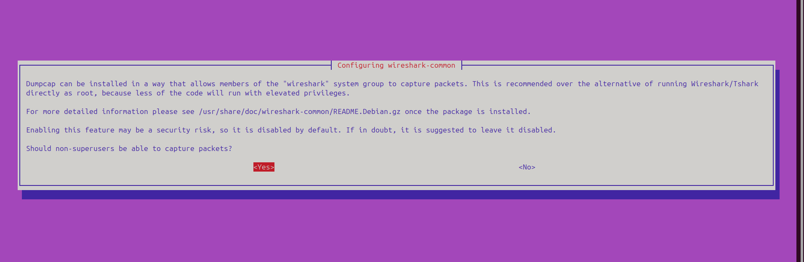
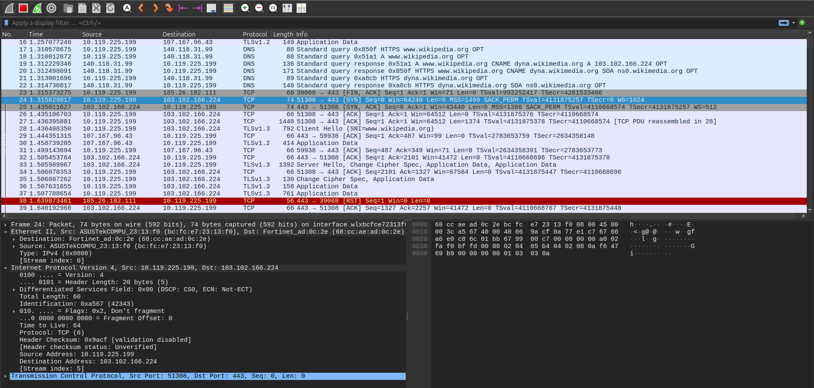
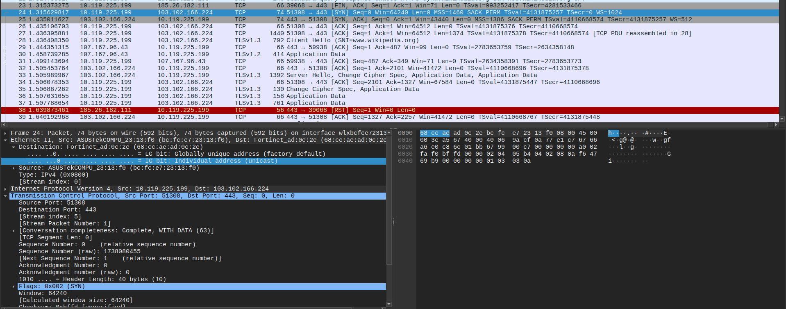
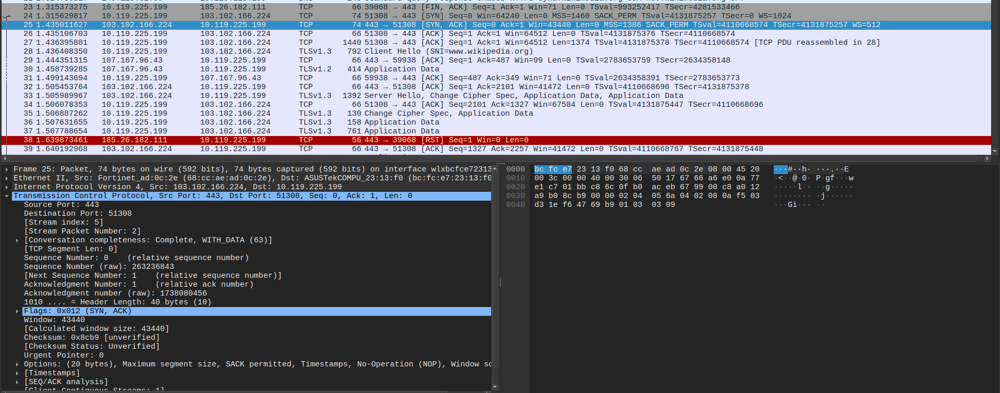
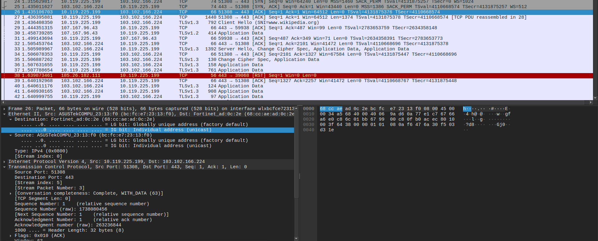
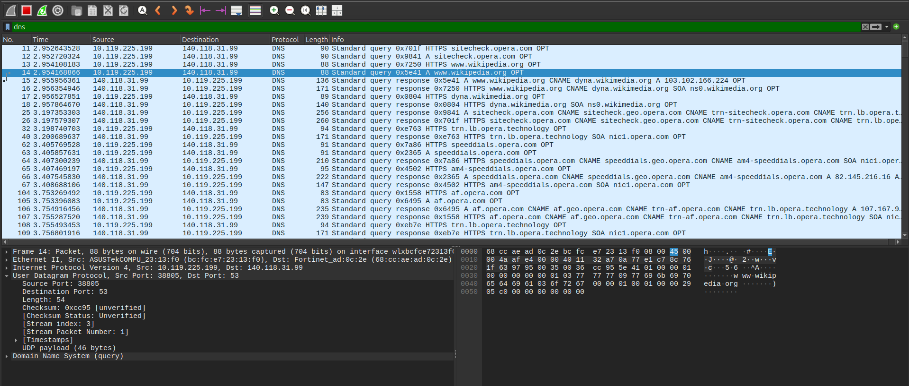
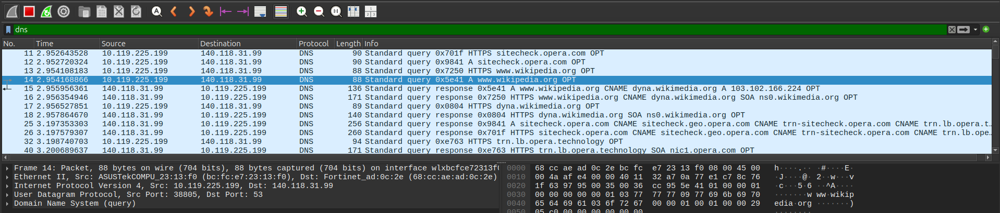
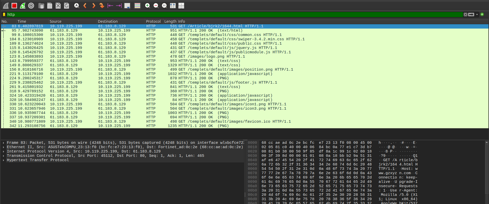
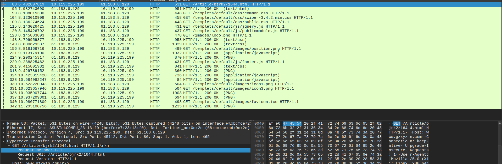
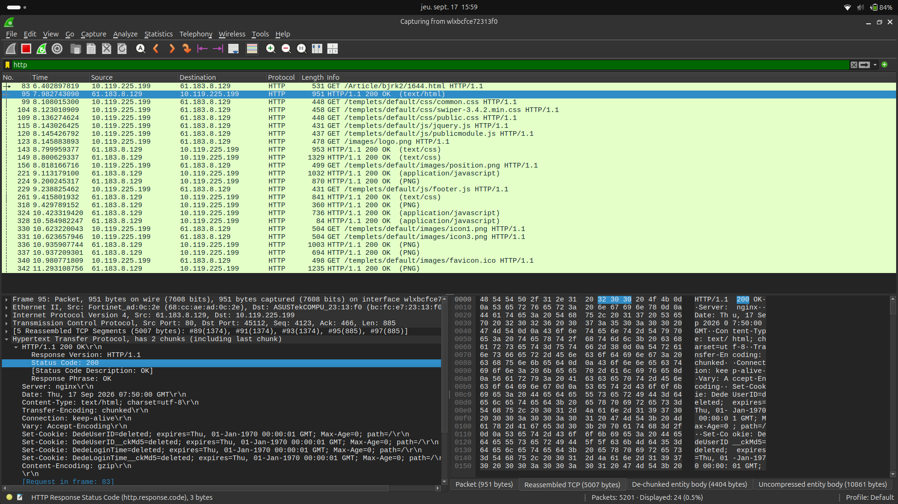

# LAB0 -- Initiation to Wireshark

## 1) How to Install Wireshark on Ubuntu

This tutorial explains how to install and launch the latest stable version of Wireshark on Ubuntu using the official PPA.

---

### Step 1: Add the Official Wireshark PPA

Open your terminal and run the following command to add the official PPA repository:

```bash
sudo add-apt-repository ppa:wireshark-dev/stable
```

> **Note:** When prompted, press <kbd>Enter</kbd> to confirm and proceed with adding the repository.

---

### Step 2: Update Package Lists & Install Wireshark

Run the update command, followed by the installation command:

```bash
sudo apt update
sudo apt install wireshark
```

---

### Step 3: Configure Non-Superuser Packet Capture

During the installation process, a configuration screen will appear titled **Configuring wireshark-common**:



1. Use the directional arrow keys (<kbd>←</kbd> / <kbd>→</kbd>) to highlight **`<Yes>`**.
2. Press <kbd>Enter</kbd> to confirm.

---

### Step 4: Launch Wireshark

You can launch Wireshark using either of the following methods:

- **Via Terminal:**
  ```bash
  wireshark
  ```
- **Via Application Menu:** Open your desktop application menu, search for **Wireshark**, and click the icon to launch.

---

### Additionnal step:

If you don't see your wireless and ethernet port in the capture tab (wl... or eth0), you'll need to: 

- Close Wireshark and run this command in a terminal
  ```bash
  sudo usermod -aG wireshark $USER
  ```
*Verification*: Run groups $USER and ensure wireshark appears in the list.  

- Then, reboot your PC and after relaunching Wireshark, the ports should appear under the capture tab.

---

## 2) Website Packet Capture



### 2.1) Which website did you access?  
- www.wikipedia.org

### 2.2) What are the IP address and port number of the website server?  
- IP address : 103.102.166.224 and port number : 443

### 2.3) What are the IP address and source port number of your PC when initially accessing the website?  
- IP address : 10.119.225.199 and port number : 51308

### 2.4) What is the process of the TCP three-way handshake?

- SYN (synchronize) packet : Client send a SYN packet to the server to initialize connection


- SYN-ACK (synchronize-acknoledgment) packet : the server respond with a SYN-ACK packet to acknowledge the client request


- ACK (acknoledge) packet : the client send it back to confirm reception of the syn-ack packet, connection established


--- 

## 3) DNS Packet Analysis



### 3.1) What are the IP address and port number of the DNS server?  
- Ip address : 140.118.31.99 and destination port : 53

### 3.2) What is the domain name in the DNS query?
- www.wikipedia.org

### 3.3) Which protocols does this DNS packet use? List the protocols from Layer 2 to Layer 5 in the TCP/IP five-layer model:



Layer 2 (Link): Ethernet II  
Layer 3 (Network): IPv4 (Internet Protocol Version 4)  
Layer 4 (Transport): UDP (User Datagram Protocol)  
Layer 5 (Application): DNS (Domain Name System)

--- 

## 4) Access an HTTP page

### 4.1 Which HTTP page did you access?
- http://www.gzxyzn.com/Article/bjrk2/1644.html

### 4.2 What is the IP address and port of the server hosting this page?
- IP address : 61.183.8.129  and port : 80
  


### 4.3 What is the HTTP request method?
- It's the GET request method



### 4.4) What is the HTTP response status code, and what does it mean?
- The Status code is 200 OK, it indicates that the request succeeded and the server successfully returned the requested webpage.


